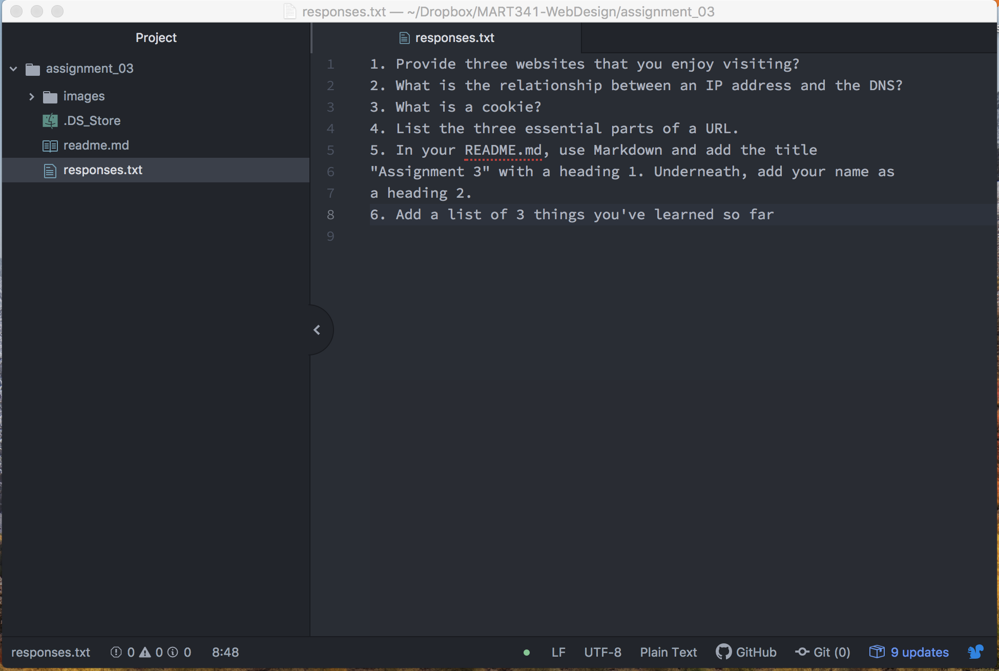

# Assignment 3
## Daylin Scott
1. A link to any website you visit frequently using its absolute URL.
   [Ryan McGinley](https://ryanmcginley.com/)
2. A link to your responses.txt file using its relative URL.
  
3. An embedded image of your screenshot using its relative
URL.

4. I have learned
- The relationship between DNS and IP addresses, the videos were very visual and helpful for me
- How to embed images and URLs in markdown because I had honestly forgotten since the last time I took this class
- Inline code and syntax highlighting -- tottally forgot that was a thing
