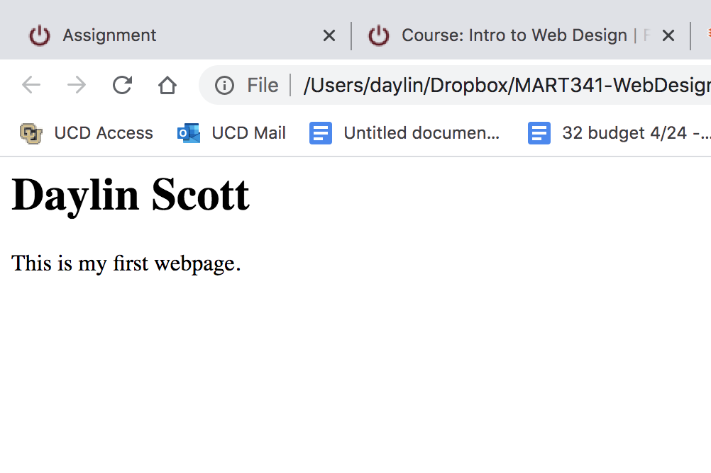

# Assignment 4
1. Very briefly detail how browsers function. List any browsers you currently use to surf - or even develop for - the web.
A browser (web/internet) is a type of software used to acess the internet. A few examples of these are Google Chrome, Firefox and Internet Explorer.

2. What is a markup language? Describe one commonly used in development.
A markup language is a language that is uses tags in a document to define specific elements and create the overall placement and layout of the text on the webpage. An example of this that is commonly used in development is HTML

