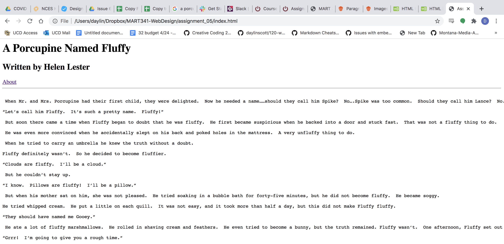

# Daylin Scott MART341-WebDesign
1. Visit a site using The Wayback Machine, looking at a snapshot at least 10 years old. Where did
you go? What did it look like? How has it changed?
I first went to google.com, but then thought that was more of a browser than a "site" so I went to nike.com during November of 2009, the site first takes you to an option for you to choose your language, and then your country, and then finally to a menu that has the different categories of Nike wear. The site was very minimalist, just a gray menu box with the Nike swoosh at the top in an orange box, the shoes are small images with orange arial type labeling them. The site currently is much more user friendly, and while still minimalistic, much more aesthetically pleasing. Not to mention the quality in the photos of their merchandise.
2. Summarize your experience with these last few topics. What did you learn? What was difficult,
easy, or still misunderstood?
This week was really helpful for me, I've forgotten so much since I learned HTML initially and working through the homeworks gives me new skills to apply to the site that I am working on. I had some trouble with re-directing back to the home page, but after some googling, found that you simply need to add another period to go up a directory. Also, for the life of me I can not get the image to show up, it looks like I'm doing everything right, the folder is labeled images and the image is "helen.jpg" but I can not get it to show up. I'm sure it's something super simple that I am not seeing and I feel dumb because it seems so straight forward, so your feedback will be greatly appreciated.
3. An embedded image of your screenshot using its relative URL.

